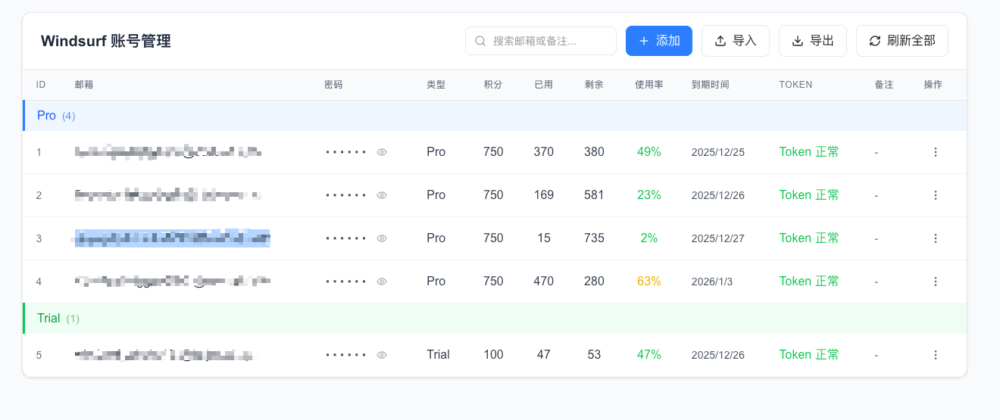

# Windsurf Account Manager

一个基于 Next.js 的 Windsurf 账号管理 Web 应用，支持多账号管理、积分查询、Token 刷新等功能。

## 演示

🔗 **在线演示**: [https://winsurf-account-manager.vercel.app/](https://winsurf-account-manager.vercel.app/)



## 功能特性

- **多账号管理** - 添加、编辑、删除多个 Windsurf 账号
- **积分查询** - 实时查询账号积分使用情况
- **Token 刷新** - 自动刷新 Firebase Token
- **分组显示** - 按账号类型（Pro/Free）分组展示
- **导入导出** - 支持账号数据的导入导出
- **一键复制** - 快速复制邮箱、密码、API Key、Token

## 技术栈

- **框架**: Next.js 16 (App Router)
- **语言**: TypeScript
- **样式**: TailwindCSS
- **图标**: Lucide React
- **部署**: Vercel

## 安全性

- **本地存储** - 所有账号数据仅存储在浏览器 localStorage，不会上传到任何服务器
- **无后端数据库** - 应用不收集、不存储任何用户数据
- **API 直连** - 登录和查询请求通过 Next.js API Routes 直接调用 Firebase/Windsurf 官方 API
- **开源透明** - 代码完全开源，可自行审查

> ⚠️ 建议：部署到私有环境使用，避免在公共网络上暴露敏感信息

## 快速开始

```bash
# 安装依赖
npm install

# 启动开发服务器
npm run dev

# 构建生产版本
npm run build
```

访问 [http://localhost:3000](http://localhost:3000) 查看应用。

## 项目结构

```
src/
├── app/
│   ├── api/           # API Routes
│   │   ├── login/     # 登录接口
│   │   ├── refresh-token/  # Token 刷新
│   │   ├── register/  # 获取 API Key
│   │   └── plan-status/    # 积分查询
│   └── page.tsx       # 主页面
├── components/        # React 组件
│   ├── AccountTable.jsx
│   ├── AccountModal.jsx
│   ├── ActionMenu.jsx
│   └── Toast.jsx
└── lib/              # 工具库
    ├── storage.ts    # 本地存储
    └── accountApi.ts # API 调用
```

## 部署

推荐使用 Vercel 一键部署：

[](https://vercel.com/new)

## License

MIT
